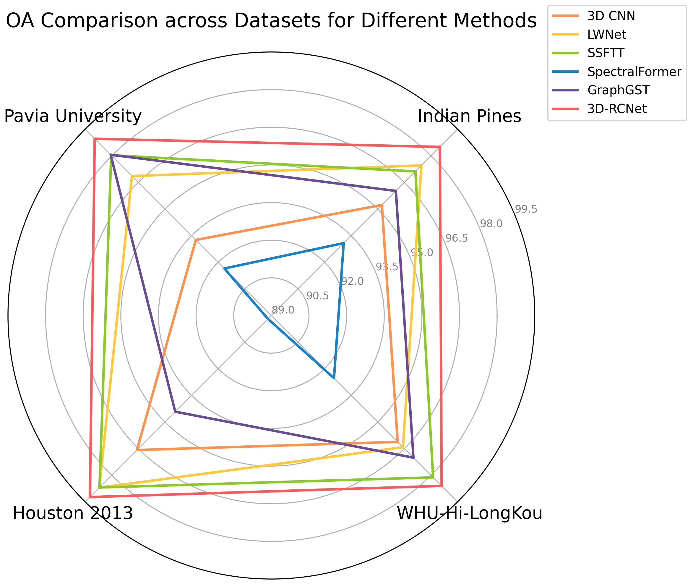

### [3D-RCNet:Learning from Transformer to Build a 3D Relational ConvNet for Hyperspectral Image Classification](https://arxiv.org/abs/2408.13728)

<br>

<br>

### The 3D-RCNet framework


Fig1. The 3D-RCNet framework proposed by us, and the framework uses four stages of blocks for feature extraction at different depths on HSI data<br>

<br>

### Comparison of the three methods


Fig2. Comparison of the three methods, the total MACs required by each method with the same input. (a) is 3D-ConvBlock,(b) is Self-attention, and (c) is our proposed 3D-RCBlock. <br>

<br>


<br>

<br>

## Experimental Results


Fig3.False color composites of experimental HSI datasets and the ground truth of land cover type. 

**(a)** Indian Pines Dataset. 

**(b)** Pavia University Dataset. 

**(c)** Houston 2013 Dataset.

**(d)** WHU-Hi-LongKou dataset.<br>


<br>

Fig4.In comparative experiments conducted on the Indian Pine dataset, we visualize the prediction results. 

**(a)** is the Ground Truth. 

**(b)** is the prediction result of 3D CNN. 

**(c)** is the prediction result of LWNet. 

**(d)** is the prediction result of SSFTT. 

**(e)** is the prediction result of SpectralForm. 

**(f)** is the prediction result of GraphGST. 

**(g)** is the prediction result of our proposed 3D-RCNet. <br>

<br>


<br>

<br>


Fig5. In comparative experiments conducted on the Pavia University dataset, we visualize the prediction results. **(a)** is the Ground Truth. **(b)** is the prediction result of 3D CNN. **(c)** is the prediction result of LWNet. **(d)** is the prediction result of SSFTT. **(e)** is the prediction result of SpectralForm. **(f)** is the prediction result of GraphGST. **(g)** is the prediction result of our proposed 3D-RCNet. <br>

<br>

<br>


Fig6. In comparative experiments conducted on the Houston 2013 dataset, we visualize the prediction results. (a) is the Ground Truth. (b) is the prediction result of 3D CNN. (c) is the prediction result of LWNet. (d) is the prediction result of SSFTT. (e) is the prediction result of SpectralForm. (f) is the prediction result of GraphGST. (g) is the prediction result of our proposed 3D-RCNet.<br>


<br>

<br>


Fig7. In comparative experiments conducted on the WHU-Hi-LongKou dataset, we visualize the prediction results. (a) is the Ground Truth. (b) is the prediction result of 3D CNN. (c) is the prediction result of LWNet. (d) is the prediction result of SSFTT. (e) is the prediction result of SpectralForm. (f) is the prediction result of GraphGST. (g) is the prediction result of our proposed 3D-RCNet.

<br>

<br>



Fig8. The predicted Overall Accuracy on the four datasets for our proposed 3D-RCNet and the five comparison methods.

<br>


<br>


Fig9. Experimenting the effect of different kernel sizes on classification accuracy in Stage 4<br>


Fig10. The effect of the number of 3D-RCBlock on classification accuracy by replacing all blocks in the stage with 3D-RCBlock<br>

<br>


Fig11. Feature extraction on Indian Pine dataset using 3D-ConvBlock and 3D-RCBlock: 3D-ConvBlock utilizes a static kernel to extract features from data with varying spatial positions, while our 3D-RCBlock generates dynamic kernels based on the local relationships within the data window for feature extraction.

<br>

<br>

### Directory and File Structure

```
./                                            # current (project) directory
│
├── assets									  # figures and tables 
│
├── data/                                     # Files to be processed in the dataset
│   └── HSI_datasets/
│       ├── data_h5/
│       └── samples/
├── data_preprocess/
│   ├── data_list/                            # The preprocessed data is placed in the data_list folder.
		├──Indian_pines_split.txt
│   ├── functions_for_samples_extraction.py
│   ├── mat_2_h5.py                           # Dataset format conversion
│   └── preprocess.py                         # Preprocessing the dataset
└── training/
    ├── models/
    ├── functions_for_evaluating.py
    ├── functions_for_training.py
    ├── get_cls_map.py                        # Generating pseudocolored synthesized images
    └── main_cv_paper.py
```

**🔥🔥🔥Note:** The `Indian_pines.txt`, `Indian_pines_test.txt`, and `Indian_pines_train.txt` files generated in the `data_list` directory are created by executing `mat_2_h5.py` and `preprocessing.py` in sequence.🔥🔥🔥<br>

**The `data` folder contains the datasets to be processed**

**`data_preprocess` folder:**

The `data_list` folder contains preprocessed data.

- `mat_2_h5.py`: Dataset format conversion
- `preprocess.py`: Data preprocessing
  - `functions_for_samples_extraction.py`

**`training`folder:**

The `models` folder contains our proposed 3D-RCNet.

- `get_cls_map.py`: Generate pseudo-color composite images
- `main_cv_paper.py`: Training script
  - functions_for_training.py
  - functions_for_evaluating.py


<br>

## **Environment Setup and Installation**

`python: 3.11`

**NOTE: Latest PyTorch requires Python 3.8 or later.**